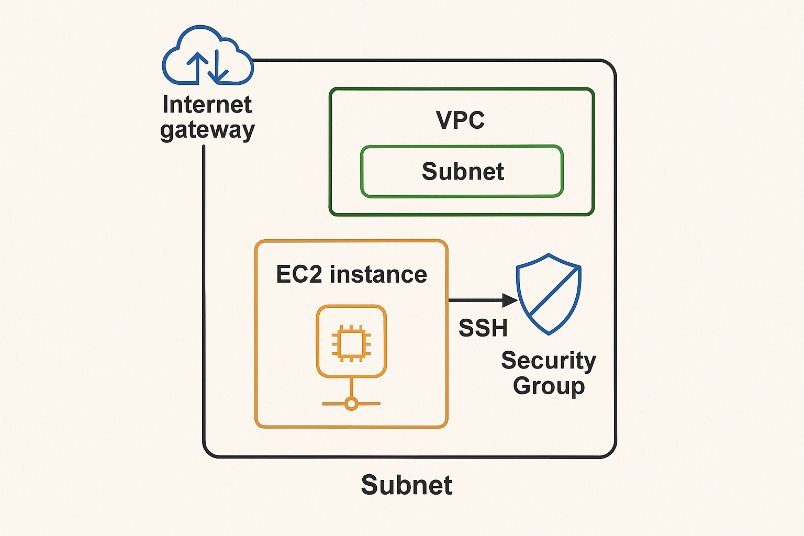

# terraform-aws-vpc-ec2
このプロジェクトは、Terraformを用いてAWS上にEC2インスタンスを構築するインフラ構成のポートフォリオです。  
クラウドエンジニアとしての転職活動を目的とし、IaC（Infrastructure as Code）の実践力を示すために作成しました。

## 🔧 使用技術
- Terraform
- AWS（EC2）
- GitHub

## 📐 構成図

以下の構成図は、Terraformによって構築されるAWSリソースの概要を示しています。

## 🚀 デプロイ手順

1. AWS CLIの認証情報を設定
2. Terraformの初期化  
   `terraform init`
3. Terraformのプラン確認  
   `terraform plan`
4. Terraformの適用  
   `terraform apply`

## 📄 ファイル構成
